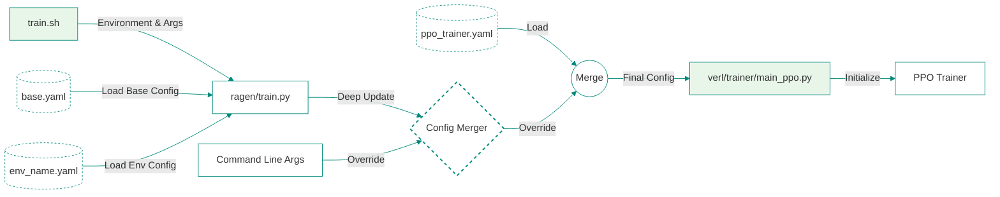

# Practical Usage Config Flow
This document explains how configuration parameters flow through the `RAGEN` training system, from initial YAML file `config/base.yaml` to the final `verl` PPO trainer execution.

## System Flow Diagram



## Overview

The configuration flow follows this sequence:
1. Base configuration loading from YAML files
2. Command-line parameter overrides
3. Environment-specific configuration merging
4. Final parameter propagation to the PPO trainer

## Configuration Sources

### 1. YAML Configuration Files

The system uses two primary YAML configuration files:
- `config/base.yaml`: Contains default configurations
- `config/{env_name}.yaml`: Environment-specific configurations (e.g., `config/sokoban.yaml`)

### 2. Command-Line Arguments

Configuration parameters can be overridden via command-line arguments in the `train.sh` script. For example:

```bash
bash train.sh sokoban \
    model.base_model=Qwen/Qwen2.5-7B-Instruct \
    model.experiment_name=sokoban_7B_instruct_ragen_main \
    training.train_batch_size=4 \
    training.max_turns=5 \
    training.n_rollout=8 \
    training.micro_batch_size=4 \
    training.ppo_batch_size=32 \
    optimization.kl_coef=0.001 \
    optimization.adv_estimator=brpo
```

## Configuration Flow Process

### 1. Initial Configuration Loading

When `train.sh` is executed, it triggers the following process:

1. `train.sh` calls `ragen/train.py` with the environment name and overrides:
```bash
python ragen/train.py "$ENV_NAME" "$@" | bash
```

2. `train.py` loads the base configuration:
```python
def load_config(env_name: str):
    with open("config/base.yaml", 'r') as f:
        config = yaml.safe_load(f)
```

### 2. Configuration Merging

The system then merges configurations in this order:

1. Base configuration (`base.yaml`)
2. Environment-specific configuration (`{env_name}.yaml`)
3. Command-line overrides

The merging process uses a deep update strategy:
```python
def deep_update(base_dict, update_dict):
    for key, value in update_dict.items():
        if isinstance(value, dict):
            base_dict[key] = deep_update(base_dict[key], value)
        else:
            base_dict[key] = value
    return base_dict
```

### 3. Parameter Translation

After merging, `train.py` translates the configuration into PPO trainer parameters. This happens in the `get_train_command()` function, which generates a complete command string for the PPO trainer.

Key parameter transformations include:

1. Model Configuration:
```python
f"actor_rollout_ref.model.path={config['model']['base_model']}"
f"actor_rollout_ref.model.enable_gradient_checkpointing={config['model']['gradient_checkpointing']}"
```

2. Training Parameters:
```python
f"data.train_batch_size={config['training']['train_batch_size']}"
f"actor_rollout_ref.actor.ppo_batch_size={config['training']['ppo_batch_size']}"
```

3. Optimization Settings:
```python
f"actor_rollout_ref.actor.optim.lr={config['optimization']['actor_lr']}"
f"actor_rollout_ref.actor.kl_loss_coef={config['optimization']['kl_coef']}"
```

### 4. Final Execution

The translated command is then executed by the shell, launching the PPO trainer (`verl/trainer/main_ppo.py`) with all configured parameters.

## Parameter Override Hierarchy

The system follows this override hierarchy (later items take precedence):

1. Default values in `base.yaml`
2. Environment-specific values in `{env_name}.yaml`
3. Environment variables (prefixed with `CONFIG_`)
4. Command-line arguments

## Example Configuration Flow

Let's trace how a specific parameter flows through the system:

1. Starting with `train.sh`:
```bash
bash train.sh sokoban training.train_batch_size=4
```

2. This is passed to `train.py`, which:
   - Loads base configuration from `base.yaml`
   - Loads Sokoban-specific configuration
   - Applies the command-line override for `train_batch_size`

3. Finally, it's translated to the PPO trainer parameter:
```bash
python -m verl.trainer.main_ppo \
    data.train_batch_size=4 \
    # ... other parameters
```

## Best Practices

1. Always specify critical parameters in YAML files rather than relying on command-line overrides for better reproducibility.
2. Use environment-specific YAML files for parameters that are consistent across runs for that environment.
3. Use command-line overrides for experimental variations or one-off changes.
4. Document any non-standard parameter combinations in experiment logs.