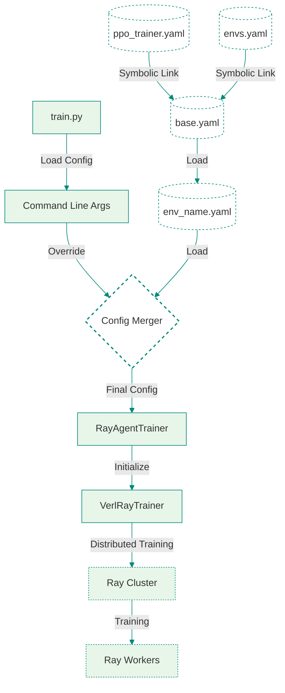

# Config Flow
This document explains how configuration parameters flow through the `RAGEN` training system, from initial YAML file `config/base.yaml` to the final trainer execution.

## System Flow Diagram



## Overview

The configuration flow in RAGEN follows the structure below:

1. Base Configuration Loading  
    - Loads default settings from `config/base.yaml`

2. Task-Specific Configuration  
    - Loads task-specific settings (e.g., `config/_2_sokoban.yaml`)

3. Command-Line Parameter Overrides  
    - Allows parameter overrides through command-line arguments

4. Configuration Merging  
    - Merges configurations following priority: command-line > task-specific > base

5. Training Initialization  
    - Passes final configuration to training components

For detailed information about configuration sources and parameters, see the [Configuration Sources](#configuration-sources) and [Config Explanation](config_exp.md) section.

## Configuration Sources

### 1. YAML Configuration Files

The system uses a hierarchical configuration system with the following YAML files:

- `config/base.yaml`: The base configuration file that includes symbolic links to:
    - `config/ppo_trainer.yaml`: Training algorithm configurations
    - `config/envs.yaml`: Environment-specific configurations
- `config/{env_name}.yaml`: Task-specific configurations (e.g., `config/_2_sokoban.yaml`)

The configuration inheritance follows this order:

1. `base.yaml` loads configurations from `ppo_trainer.yaml` and `envs.yaml`
2. Environment-specific YAML files inherit from `base.yaml`
3. Command line arguments can override any configuration from the YAML files, see the example at [Command-Line Arguments](#command-line-arguments)

### 2. Command-Line Arguments

Configuration parameters can be overridden via command-line arguments when running `train.py`. The system supports both PPO and GRPO algorithms， for example:

```bash
python train.py --config-name _2_sokoban \
    system.CUDA_VISIBLE_DEVICES="0" \
    trainer.experiment_name=sokoban-grpo \
    algorithm.adv_estimator=grpo \
    algorithm.kl_ctrl.kl_coef=0.001 \
    actor_rollout_ref.actor.use_kl_loss=True \
    actor_rollout_ref.actor.kl_loss_coef=0.001 \
    actor_rollout_ref.actor.clip_ratio_high=0.2 \
    actor_rollout_ref.rollout.rollout_filter_ratio=1
```

## Configuration Flow Process

### 1. Base Configuration Loading

The process starts with loading the base configuration:

```python
@hydra.main(version_base=None, config_path="config", config_name="base")
def main(config):
    config = add_dependency(config)
    run_ppo(config)
```

- `base.yaml` is loaded as the foundation
- It includes symbolic links to `ppo_trainer.yaml` and `envs.yaml`
- Basic system settings like GPU allocation are initialized

### 2. Task-Specific Configuration

Task-specific configurations are loaded based on the environment:

```python
python train.py --config-name _2_sokoban
```

- Task-specific settings (e.g., `_2_sokoban.yaml`) are loaded
- These configurations inherit from `base.yaml`.

### 3. Command-Line Parameter Overrides

Command-line arguments can override any configuration:

```python
python train.py --config-name _2_sokoban \
    system.CUDA_VISIBLE_DEVICES="0" \
    trainer.experiment_name=sokoban-grpo \
    algorithm.adv_estimator=grpo
```

### 4. Configuration Merging

The system merges configurations following priority:

```python
config = add_dependency(config)
```

1. Command-line arguments (highest)
2. Task-specific configuration
3. Base configuration (lowest)

The merging process:

- Uses Hydra's configuration system
- Preserves nested structure
- Handles symbolic links and variable interpolation

### 5. Training Initialization

The final configuration is passed to training components:

```python
def run_ppo(config) -> None:
    os.environ["CUDA_VISIBLE_DEVICES"] = str(config.system.CUDA_VISIBLE_DEVICES)
    runner = TaskRunner.remote()
    ray.get(runner.run.remote(config))
```

## Example Configuration Flow

Let's trace how a specific parameter flows through the system:

1. Starting with `train.py` and command-line arguments:
```bash
python train.py --config-name _2_sokoban \
    system.CUDA_VISIBLE_DEVICES="0" \
    trainer.experiment_name=sokoban-grpo \
    algorithm.adv_estimator=grpo \
    actor_rollout_ref.actor.micro_batch_size_per_gpu=4
```

2. The configuration system:

    - Loads base configuration from `base.yaml`, which includes symbolic links to `ppo_trainer.yaml` and `envs.yaml`
    - Loads Sokoban-specific configuration from `_2_sokoban.yaml`
    - Applies the command-line overrides, including the batch size setting

3. The final configuration is used to initialize the training components:
```python
# In train.py
@hydra.main(version_base=None, config_path="config", config_name="base")
def main(config):
    config = add_dependency(config)
    run_ppo(config)

# In RayAgentTrainer
def __init__(self, config, tokenizer, role_worker_mapping, resource_pool_manager, ...):
    super().__init__(config, tokenizer, role_worker_mapping, resource_pool_manager, ...)
    self.config = config  # Contains the final merged configuration
```

4. The batch size parameter is then used in various components:
```python
# In RayAgentTrainer
def _create_dataloader(self):
    # Uses config.actor_rollout_ref.actor.micro_batch_size_per_gpu
    # for creating the data loader
    self.config.actor_rollout_ref.actor.micro_batch_size_per_gpu = config.micro_batch_size_per_gpu
```
